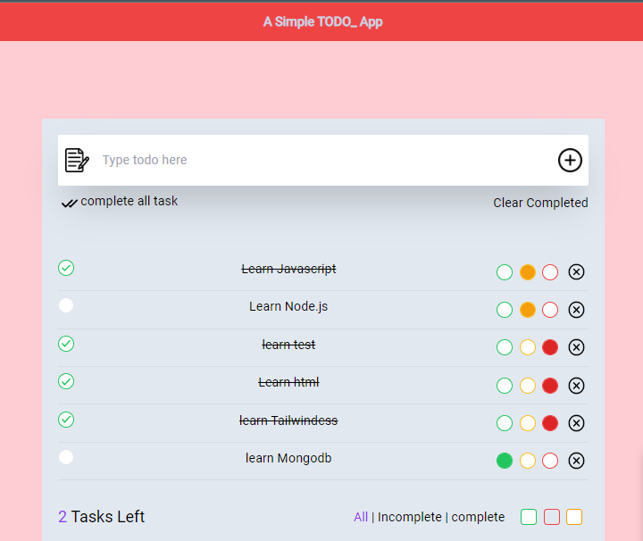

<ul>
        <li><b>CSS:</b> Tailwindcss</li>
        <li><b>REDUX:</b> redux/react-redux</li>
</ul>

        <b style={{color:'red',textAlign:'center', backgroundColor:'#bae6fd'}}>This project isn't responsive. I focused tailwind & redux/react-redux pracice </b>

